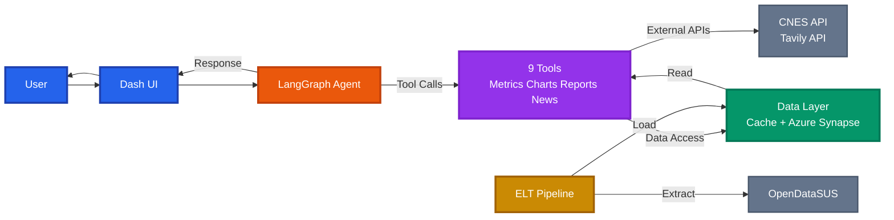
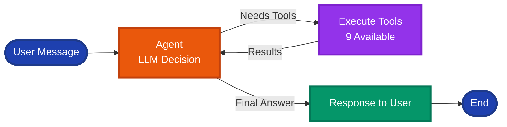
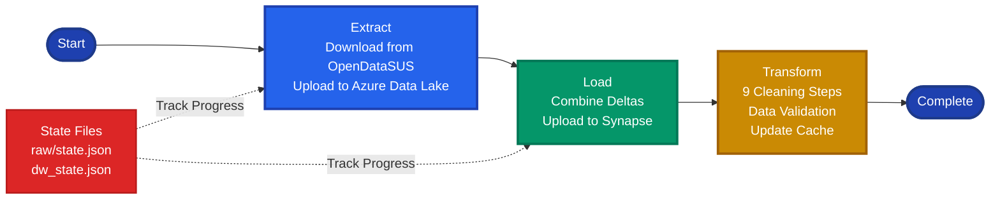
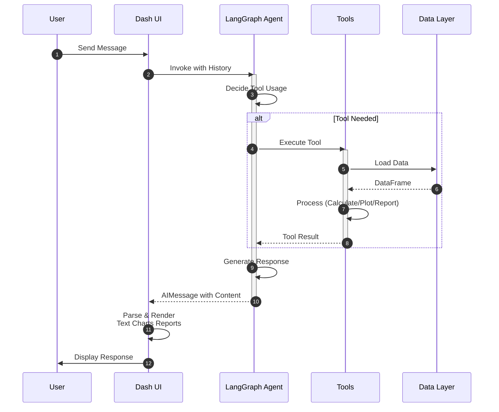

# SRAG Data Analysis Platform

A **Dash web application** with an **AI chat interface** for analyzing Brazilian SRAG (Severe Acute Respiratory Syndrome) epidemiological data. The platform provides real-time metrics, interactive charts, and comprehensive reports using data from OpenDataSUS.

## Key Features

- **AI Chat Interface**: Natural language queries about SRAG data powered by LangGraph and OpenAI GPT models
- **Metrics Dashboard**: Calculate mortality rates, ICU occupancy, vaccination coverage, and case trends
- **Interactive Charts**: Daily and monthly case visualizations with customizable date ranges using Plotly
- **Report Generation**: Automated Markdown/ZIP reports with data analysis, charts, and news integration
- **ELT Pipeline**: Incremental data extraction from OpenDataSUS with Azure Data Lake Gen2 storage and Synapse Analytics
- **Modular Architecture**: Well-organized codebase with clear separation of concerns (UI, agent, tools, ELT, metrics)

---

## Prerequisites

### Required Software

- **Python 3.12+**
- **UV package manager** - [Install UV](https://docs.astral.sh/uv/getting-started/installation/)
- **Azure CLI** - [Install Azure CLI](https://learn.microsoft.com/en-us/cli/azure/install-azure-cli)
- **Git**

### Azure Account Setup

> **IMPORTANT**: An active Azure account with subscription is required.

1. **Create Azure Account**
   - Go to [Azure Portal](https://portal.azure.com)
   - Create a free account if you don't have one ([Free Azure Account](https://azure.microsoft.com/free/))

2. **Activate Subscription**
   - Verify you have an active subscription in Azure Portal → Subscriptions
   - Note your **Subscription ID** (you'll need it for setup)

3. **Install Azure CLI**
   - **macOS**: `brew install azure-cli`
   - **Windows**: Download from [Microsoft](https://learn.microsoft.com/en-us/cli/azure/install-azure-cli-windows)
   - **Linux**: Follow [Linux instructions](https://learn.microsoft.com/en-us/cli/azure/install-azure-cli-linux)

4. **Login to Azure**
   ```bash
   az login
   ```

5. **Verify Subscription**
   ```bash
   az account show
   ```

### ODBC Driver Installation

Required for Azure SQL Database connectivity.

**macOS (Homebrew)**:
```bash
brew install unixodbc
brew tap microsoft/mssql-release https://github.com/Microsoft/homebrew-mssql-release
HOMEBREW_ACCEPT_EULA=Y brew install msodbcsql18
```

**Windows**:
- Download and install [ODBC Driver 18 for SQL Server](https://learn.microsoft.com/en-us/sql/connect/odbc/download-odbc-driver-for-sql-server)

**Linux (Ubuntu/Debian)**:
```bash
curl https://packages.microsoft.com/keys/microsoft.asc | sudo apt-key add -
curl https://packages.microsoft.com/config/ubuntu/$(lsb_release -rs)/prod.list | sudo tee /etc/apt/sources.list.d/mssql-release.list
sudo apt-get update
sudo ACCEPT_EULA=Y apt-get install -y msodbcsql18
```

---

## Installation

1. **Clone the repository**
   ```bash
   git clone <repository-url>
   cd <repository-folder>
   ```

2. **Install dependencies**
   ```bash
   uv sync
   ```

3. **Create environment file**
   ```bash
   cp .env.example .env
   ```

4. **Configure API Keys**
   
   Edit `.env` and add your keys:
   ```env
   OPENAI_API_KEY=your-openai-api-key # https://platform.openai.com/account/api-keys
   TAVILY_API_KEY=your-tavily-api-key # https://tavily.com/api
   ```

---

## Azure Infrastructure Setup

> **CRITICAL**: Run this before starting the application for the first time.

The setup script creates all required Azure resources:
- Resource Group
- Storage Account (Data Lake Gen2)
- SQL Server and Database
- Assigns necessary permissions

### Before running

- Run from the **project root** so the script finds `.env` when it exists.
- The script **loads `.env` automatically** if the file exists; you do **not** need to run `source .env` before the script.
- **When `.env` exists**, `SUBSCRIPTION_ID` must be set in `.env` (get it from Azure Portal or `az account show --query id -o tsv` after `az login`). If `.env` does not exist, the script uses the subscription from `az account show`.

### Unix / macOS / Linux

From the project root:

```bash
chmod +x scripts/azure-setup.sh
./scripts/azure-setup.sh
```

### Windows

Run from the project root. Use one of:

**Option 1 – Git Bash or WSL**:
```bash
bash scripts/azure-setup.sh
```

**Option 2 – PowerShell with WSL**:
```powershell
wsl bash scripts/azure-setup.sh
```

### After Setup

1. The script **prints** credentials at the end. Copy the printed block into your `.env` file.
2. Ensure these variables (or their placeholders when Synapse/SQL pool was skipped on Free Trial) are in `.env`:
   ```env
   SUBSCRIPTION_ID=
   AZURE_TENANT_ID=
   AZURE_CLIENT_ID=
   AZURE_CLIENT_SECRET=
   STORAGE_ACCOUNT_NAME=
   FILE_SYSTEM_NAME=
   AZURE_SYNAPSE_WORKSPACE_NAME=
   AZURE_RESOURCE_GROUP=
   AZURE_SQL_POOL_NAME=
   AZURE_SYNAPSE_SQL_ENDPOINT=
   AZURE_SQL_ADMIN_USER=
   AZURE_SQL_ADMIN_PASSWORD=
   AZURE_SQL_POOL_PERFORMANCE_LEVEL=
   AZURE_STORAGE_KEY=
   AZURE_STORAGE_SAS_TOKEN=
   ```
   If Synapse or the SQL pool was skipped (e.g. Free Trial), the script prints placeholders like `<SYNAPSE_NOT_AVAILABLE_FREE_TRIAL>` or `<SQL_POOL_QUOTA_FREE_TRIAL>`; the Data Lake and ELT can still run without Synapse.

### Costs and Synapse

The **Dedicated SQL Pool** is billed 24/7 while **Online**. Resume/pause is automatic when you click **Atualizar Dados**. For manual control, wait until the pool is fully provisioned (provisioningState Succeeded), then:

- **Pause:** `az synapse sql pool pause --name <pool> --workspace-name <workspace> -g <rg>`
- **Resume:** `az synapse sql pool resume --name <pool> --workspace-name <workspace> -g <rg>`

Use `--storage-only` when running `scripts/azure-setup.sh` to create only Storage (file system, directories, Service Principal, key, SAS) and **not** Synapse Workspace or the SQL Pool. This suits scenarios where you only need Data Lake.

---

## Running the Application

1. **Start the application**
   ```bash
   uv run python app.py
   ```

2. **Access the UI**
   - Open http://localhost:8050 in your browser

3. **First-time data loading**
   - Click the **"Atualizar Dados"** button in the UI
   - Wait for the ELT pipeline to complete (may take several minutes on first run)
   - The status indicator will show when data is ready

---

## Usage Guide

### Chat Interface

Ask questions in Portuguese about SRAG data:

- **Metrics**: "Qual a taxa de mortalidade em São Paulo?"
- **Charts**: "Mostre o gráfico de casos diários dos últimos 60 dias"
- **Reports**: "Gere um relatório completo para o Brasil"
- **News**: "Quais as notícias recentes sobre SRAG?"

### Example Queries

| Query Type | Example |
|------------|---------|
| Mortality Rate | "Taxa de mortalidade no RJ nos últimos 30 dias" |
| ICU Occupancy | "Ocupação de UTI em Minas Gerais" |
| Vaccination | "Taxa de vacinação contra COVID no Brasil" |
| Daily Chart | "Gráfico de casos diários em SP, 60 dias" |
| Monthly Chart | "Casos mensais no Paraná, últimos 12 meses" |
| Full Report | "Relatório completo para Santa Catarina" |

### Data Updates

- Click **"Atualizar Dados"** to fetch latest data from OpenDataSUS
- The application shows the last extraction date
- Incremental updates fetch only new records

---

## Troubleshooting

### Common Issues

| Issue | Solution |
|-------|----------|
| "Azure login failed" | Run `az login` and select correct subscription |
| "ODBC Driver not found" | Reinstall ODBC driver following instructions above |
| "No data available" | Click "Atualizar Dados" to load data |
| "OpenAI API error" | Verify `OPENAI_API_KEY` in `.env` |
| "Storage connection failed" | Check Azure credentials in `.env` |

### Azure Connection Issues

1. Verify Azure CLI login: `az account show`
2. Check subscription: `az account list`
3. Ensure resources exist: `az resource list --resource-group <your-rg>`

### Data Loading Issues

1. Check network connectivity
2. Verify Azure credentials
3. Check console for error messages
4. Try running ELT again after a few minutes

---

## Project Structure

```
├── app.py                      # Main Dash application entry point
├── .env.example                # Example environment variables (copy to .env)
├── pyproject.toml              # Project dependencies and configuration
├── src/
│   ├── ui/                     # Dash UI components and callbacks
│   │   ├── layout.py           # Main UI layout
│   │   ├── callbacks.py        # Chat interaction callbacks
│   │   ├── elt_callbacks.py    # ELT pipeline UI callbacks
│   │   ├── message.py          # Message bubble components
│   │   ├── response_parsing.py # Agent response parsing
│   │   ├── chart_render.py     # Chart rendering for UI
│   │   ├── chart_data.py       # Chart data preparation
│   │   ├── tool_parsing.py     # Tool output parsing
│   │   ├── download.py         # Report download handling
│   │   ├── state.py            # UI state management
│   │   ├── loading.py          # Loading indicators
│   │   ├── constants.py        # UI constants
│   │   └── utils.py            # UI utility functions
│   ├── agent/                  # LangGraph AI agent
│   │   ├── graph.py            # Agent graph definition and execution
│   │   └── prompts.py          # System prompts and instructions
│   ├── tools/                  # LangChain tools for the agent
│   │   ├── metric_tools.py     # Metric calculation tools
│   │   ├── chart_tools.py      # Chart generation tools
│   │   ├── reports.py          # Report generation tools
│   │   ├── news.py             # News search tool
│   │   └── location_utils.py   # Location resolution utilities
│   ├── elt/                    # Extract, Load, Transform pipeline
│   │   ├── pipeline.py         # Main ELT orchestration
│   │   ├── extract.py          # Data extraction from OpenDataSUS
│   │   ├── transform.py        # Data cleaning and transformation
│   │   ├── load.py             # Data loading facade
│   │   ├── azure.py            # Azure Data Lake operations
│   │   ├── dw.py               # Azure Synapse Data Warehouse operations
│   │   ├── deltas.py           # Delta file management
│   │   ├── state.py            # ELT state management
│   │   ├── cache.py            # Local caching utilities
│   │   └── errors.py           # ELTError for pipeline failure reporting
│   ├── charts/                 # Plotly visualization
│   │   ├── charts.py           # Chart generation functions
│   │   └── stats.py            # Statistical calculations
│   ├── metrics/                 # Metric calculations
│   │   └── calculators.py      # Core metric calculation functions
│   ├── report/                 # Report generation
│   │   ├── generator.py        # LLM-based report generation
│   │   ├── templater.py        # Report template facade
│   │   ├── templates.py        # Jinja2 templates
│   │   ├── formatter.py        # Report formatting
│   │   ├── parser.py           # Report parsing and summarization
│   │   ├── llm.py              # LLM integration for reports
│   │   └── files.py            # Report file operations
│   ├── retrieval/               # External data retrieval
│   │   ├── icu_beds.py         # CNES ICU beds data fetcher
│   │   └── news_fetcher.py     # Tavily news API integration
│   └── common/                  # Shared configuration and utilities
│       ├── config.py            # Centralized configuration constants
│       └── logging.py           # Loguru setup (console + logs/app.log, rotation)
├── diagrams/                   # Architecture diagrams (Mermaid)
│   ├── architecture-overview.mmd
│   ├── agent-flow.mmd
│   ├── elt-pipeline.mmd
│   ├── user-interaction-sequence.mmd
│   ├── tools-detail.mmd
│   ├── data-flow-detail.mmd
│   ├── elt-extract-detail.mmd
│   ├── elt-transform-steps.mmd
│   ├── elt-load-detail.mmd
│   ├── metrics-calculation-flow.mmd
│   └── report-generation-flow.mmd
├── scripts/
│   └── azure-setup.sh          # Azure infrastructure setup script
├── assets/
│   └── custom.css              # Custom CSS styling
└── data/                       # Local data cache (gitignored)
```

### Architecture Overview

**High-level system architecture showing the main components and data flow.**

<div align="center">



</div>

The application follows a modular architecture with clear separation of concerns:

- **UI Layer** ([`src/ui/`](src/ui/README.md)): All Dash components, callbacks, and UI-related logic
- **Agent Layer** ([`src/agent/`](src/agent/README.md)): LangGraph agent definition and prompt management
- **Tools Layer** ([`src/tools/`](src/tools/README.md)): LangChain tools that the agent can call
- **Data Layer** ([`src/elt/`](src/elt/README.md), [`src/charts/`](src/charts/README.md), [`src/metrics/`](src/metrics/README.md)): Data processing, transformation, and calculations
- **Report Layer** ([`src/report/`](src/report/README.md)): Report generation with LLM integration
- **Retrieval Layer** ([`src/retrieval/`](src/retrieval/README.md)): External API integrations (CNES, Tavily)
- **Common Layer** ([`src/common/`](src/common/README.md)): Shared configuration and constants

### Module Documentation

Each module has detailed documentation:

- **[Agent Module](src/agent/README.md)** - LangGraph conversational AI agent
- **[Charts Module](src/charts/README.md)** - Plotly visualization and statistics
- **[Common Module](src/common/README.md)** - Centralized configuration
- **[ELT Module](src/elt/README.md)** - Incremental data pipeline
- **[Metrics Module](src/metrics/README.md)** - Epidemiological calculations
- **[Report Module](src/report/README.md)** - LLM-powered report generation
- **[Retrieval Module](src/retrieval/README.md)** - External data fetching
- **[Tools Module](src/tools/README.md)** - LangChain tool wrappers
- **[UI Module](src/ui/README.md)** - Dash web interface

---

## Architecture & Governance

### Architecture Design

**Agent decision flow: how the LangGraph agent processes user queries and orchestrates tool execution.**

<div align="center">



</div>

**ELT pipeline overview: the three main phases (Extract, Load, Transform) with state management.**

<div align="center">



</div>

**Complete user interaction sequence from message input to response display, including tool execution and data access.**

<div align="center">



</div>

The platform follows a modular, layered architecture with clear separation of concerns. The **LangGraph StateGraph** orchestrates agent decisions through a defined workflow: Agent Node → Router → Tool Node → Agent Node. Data flows through an incremental ELT pipeline (Extract → Load → Transform) with delta-based updates stored in Azure Data Lake Gen2 and processed in Azure Synapse Analytics. The architecture uses centralized configuration (`common.config`), local caching for performance, and a tool-based abstraction layer between the agent and data operations.

### Governance & Transparency

Agent decisions are tracked through the `AgentState` structure, which maintains conversation history (`messages`) with thread isolation via `thread_id`. All tool calls are recorded as `ToolMessage` objects in the message history. The ELT pipeline maintains state files in Azure (`raw/state.json`, `clean/dw_state.json`) tracking processed deltas, extraction dates, and processing timestamps. Pipeline execution logs each transformation step, data quality metrics, and schema analysis. All metric responses include a "Fonte de Dados" (Data Source) column indicating the data origin.

### Guardrails

Comprehensive guardrails are enforced through the 495-line `SYSTEM_PROMPT` defining non-negotiable rules: **Geographic scope** (Brazil-only, validates location before tool calls), **Medical advice** (prohibits treatment recommendations, redirects to health authorities), **Patient data** (aggregated data only, no PII access), **Harmful content** (requires tool verification before stating numbers, mandates source citations), and **Speculation** (prohibits predictions without data). The agent is instructed to "ALWAYS call tools before stating numbers - never hallucinate" and all tool outputs are validated before presentation. Parameter validation enforces limits (chart days: 7-90, months: 1-24, news: 0-5).

### Sensitive Data Handling

The platform processes only aggregated, population-level statistics. Individual patient records are never accessed or exposed. The ELT pipeline uses `select_essential()` to retain only columns necessary for metric calculations, filters out invalid records, and removes non-actionable data. The primary key (`NU_NOTIFIC`) is used solely for deduplication and is never exposed in responses. Data is stored in Azure with authentication via `DefaultAzureCredential`, and credentials are managed through environment variables. IBGE codes are used internally but never displayed to users (only city/state names are shown).

### Code Quality

The codebase follows clean code principles with modular organization, single-responsibility functions, comprehensive type hints (`Annotated`, `TypedDict`), and docstrings for all public functions. Configuration is centralized in `common.config`, validation logic is reusable, and error handling uses `ELTError(stage, message)` for pipeline failures. Structured logging via `common.logging` (loguru) is used across ELT, agent, UI, metrics, and retrieval. The data transformation pipeline is a 9-step process with schema analysis and quality reporting. Code is organized by domain (agent, tools, elt, metrics, charts, report, retrieval, ui) with clear module boundaries and README documentation for each component.

---

## Technical Details

### AI Model Configuration

- **Default Model**: `gpt-5-nano` (configurable in `src/common/config.py`)
- **Temperature**: 0.0 for agent responses, 0.3 for report generation
- **Framework**: LangGraph for agent orchestration, LangChain for tool integration

### Data Sources

- **Primary**: OpenDataSUS SRAG Dataset (2023-2025)
- **ICU occupancy**: OpenDataSUS (SRAG) for patient-days, CNES for beds (cached)
- **News**: Tavily API (optional, for context in reports)

### Storage

- **Azure Data Lake Gen2**: Raw data and delta files
- **Azure Synapse Analytics**: Processed data warehouse
- **Local Cache**: `diskcache` for ELT state and UI state
- **Logs**: `logs/app.log` (loguru, rotation 10MB, 7-day retention; `logs/` is gitignored)

### Key Technologies

- **Web Framework**: Dash with Bootstrap components
- **AI/ML**: LangGraph, LangChain, OpenAI API
- **Data Processing**: Pandas, NumPy, PyArrow
- **Visualization**: Plotly
- **Logging**: Loguru (console + file, used across ELT, agent, UI, metrics, retrieval)
- **Cloud**: Azure Data Lake Gen2, Azure Synapse Analytics
- **Database**: SQL Server via ODBC
- **Package Management**: UV

---

## License

This project was created for Indicium's AI Engineering Certification challenge.

Author: João Vitor Vargas Soares
