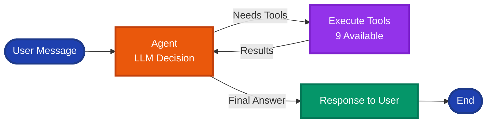

# Agent Module

> [← Back to Main README](../../README.md)

## Purpose

LangGraph-based conversational AI agent that processes natural language queries and orchestrates tool execution for SRAG data analysis. Serves as the decision-making layer between user input and data analysis capabilities.

## Architecture

**Agent decision flow showing how the LangGraph agent processes messages, decides on tool usage, and generates responses.**

<div align="center">



</div>

**LangGraph StateGraph Flow**:
```
[Agent Node] → [Router] → [Tool Node] → [Agent Node] → [END]
```

**State Schema** (`AgentState`):
- `messages`: List of LangChain `BaseMessage` objects (HumanMessage, AIMessage, ToolMessage, SystemMessage)
- `thread_id`: Conversation thread identifier

**Execution Flow**:
1. **Agent Node**: Binds tools to LLM (`llm.bind_tools(ALL_TOOLS)`), injects `SYSTEM_PROMPT`, decides tool usage
2. **Router**: Routes to tools if `tool_calls` exist, otherwise ends
3. **Tool Node**: Executes tools sequentially (with callbacks) or in parallel, returns `ToolMessage` results
4. **Loop**: Tool results feed back to agent for final response generation

## Key Components

**`graph.py`**:
- `create_agent_graph()`: Builds and compiles StateGraph
- `invoke_agent()`: Entry point with streaming support via `graph.stream()`
- `create_agent_node()`: LLM-powered decision node
- `create_tool_node()`: Sequential/parallel tool execution
- `should_continue()`: Conditional routing logic

**`prompts.py`**:
- `SYSTEM_PROMPT`: 495-line prompt defining tool selection rules, response formatting (HTML tables, Portuguese), geographic filtering (Brazil-only), and guardrails

## Technical Details

- **Streaming**: Uses `graph.stream(stream_mode="values")` with step callbacks for UI progress
- **Memory**: Optional `MemorySaver` checkpointer (disabled by default due to Dash threading)
- **Tools**: Dynamically binds 9 tools from `tools.ALL_TOOLS`
- **Config**: Default model `gpt-5-nano`, temperature `0.0`
