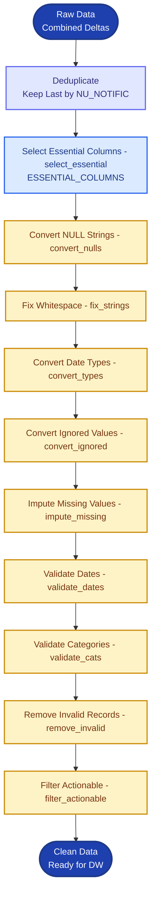
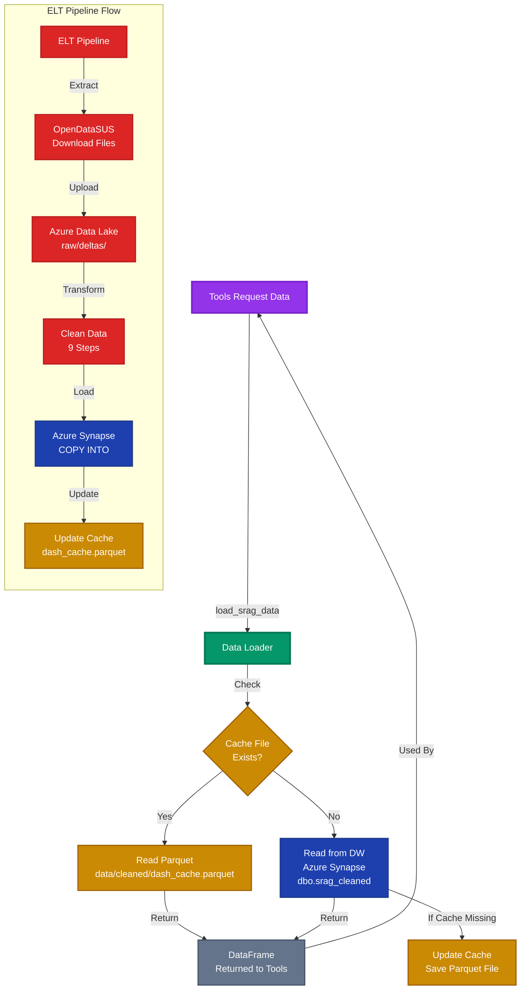

# ELT Module

> [← Back to Main README](../../README.md)

## Purpose

Incremental Extract, Load, Transform pipeline that downloads SRAG data from OpenDataSUS, cleans and validates it, and loads it into Azure Synapse Analytics. Implements delta-based incremental loading to minimize data transfer and processing time.

## Architecture

**High-level ELT pipeline showing the complete flow from data extraction through transformation and loading.**

```mermaid
flowchart LR
    Start([Start]) --> Datas[Fetch Dates<br/>OpenDataSUS Page]
    Datas --> Extract[Extract<br/>Download from OpenDataSUS]
    Extract --> Upload[Upload Deltas<br/>Azure Data Lake]
    Upload --> Download[Download Deltas<br/>Unprocessed Files]
    Download --> Transform[Transform<br/>9 Cleaning Steps]
    Transform --> Load[Load to DW<br/>Azure Synapse]
    Load --> Cache[Update Cache<br/>Local Parquet]
    Cache --> Estado[Save State<br/>Extraction Date]
    Estado --> End([Complete])
    
    State[State Files<br/>raw/state.json<br/>clean/dw_state.json] -.->|Track Progress| Upload
    State -.->|Track Progress| Load
    
    classDef extractStyle fill:#2563eb,stroke:#1e40af,stroke-width:3px,color:#fff
    classDef transformStyle fill:#ca8a04,stroke:#a16207,stroke-width:3px,color:#fff
    classDef loadStyle fill:#059669,stroke:#047857,stroke-width:3px,color:#fff
    classDef stateStyle fill:#dc2626,stroke:#b91c1c,stroke-width:2px,color:#fff
    classDef startEndStyle fill:#1e40af,stroke:#1e3a8a,stroke-width:3px,color:#fff
    
    class Extract,Upload,Download extractStyle
    class Transform transformStyle
    class Load,Cache,Estado loadStyle
    class State stateStyle
    class Start,End,Datas startEndStyle
```

<div align="center">



</div>

**Detailed extract phase: how the system downloads frozen and live data from OpenDataSUS and uploads deltas to Azure Data Lake.**

<div align="center">


</div>

**The complete data transformation pipeline: deduplication, column selection, and 9-step cleaning process.**

<div align="center">



</div>

**Detailed load phase: how unprocessed deltas are downloaded, combined, transformed, and loaded into Azure Synapse Analytics.**

```mermaid
flowchart TD
    Start([Load Phase Start]) --> ReadState[Read DW State<br/>clean/dw_state.json<br/>Get processed_deltas]
    
    ReadState --> DownloadDeltas[Download Unprocessed<br/>Deltas from Azure<br/>raw/deltas/]
    
    DownloadDeltas -->|For Each Delta| LoadDelta[Load Delta File<br/>Read Parquet]
    LoadDelta --> NextDelta{More<br/>Deltas?}
    NextDelta -->|Yes| LoadDelta
    NextDelta -->|No| Combine[Combine All Deltas<br/>pd.concat<br/>Single DataFrame]
    
    Combine --> Deduplicate[Deduplicate<br/>Keep Last by NU_NOTIFIC]
    Deduplicate --> SelectEssential[Select Essential Columns<br/>ESSENTIAL_COLUMNS]
    SelectEssential --> Transform[Transform<br/>Apply 9 Cleaning Steps<br/>clean_data]
    
    Transform --> PreparePK[Prepare Primary Key<br/>Convert NU_NOTIFIC<br/>to Int64]
    PreparePK --> UploadStaging[Upload to Staging<br/>Azure Data Lake<br/>staging/timestamp_id/]
    
    UploadStaging --> CopyInto[COPY INTO Synapse<br/>dbo.srag_cleaned<br/>AUTO_CREATE_TABLE]
    
    CopyInto --> MarkDeltas[Mark Deltas Processed<br/>Update DW State<br/>clean/dw_state.json]
    
    MarkDeltas --> TrimDW[Trim DW if Needed<br/>trim_dw_to_max_rows<br/>Keep ~8M rows]
    
    TrimDW --> UpdateCache[Update Local Cache<br/>data/cleaned/dash_cache.parquet<br/>Full dataset from DW]
    
    UpdateCache --> End([Load Complete])
    
    classDef stateStyle fill:#9333ea,stroke:#7e22ce,stroke-width:2px,color:#fff
    classDef downloadStyle fill:#2563eb,stroke:#1e40af,stroke-width:2px,color:#fff
    classDef transformStyle fill:#ca8a04,stroke:#a16207,stroke-width:2px,color:#fff
    classDef uploadStyle fill:#dc2626,stroke:#b91c1c,stroke-width:2px,color:#fff
    classDef dwStyle fill:#059669,stroke:#047857,stroke-width:2px,color:#fff
    classDef cacheStyle fill:#1e40af,stroke:#1e3a8a,stroke-width:2px,color:#fff
    classDef startEndStyle fill:#1e40af,stroke:#1e3a8a,stroke-width:3px,color:#fff
    
    class ReadState,MarkDeltas stateStyle
    class DownloadDeltas,LoadDelta downloadStyle
    class Combine,Deduplicate,SelectEssential,Transform,PreparePK transformStyle
    class UploadStaging uploadStyle
    class CopyInto,MarkDeltas,TrimDW dwStyle
    class UpdateCache cacheStyle
    class Start,End startEndStyle
```

<div align="center">



**Data access flow showing how tools request data, the cache-first strategy, and how the ELT pipeline updates both cache and data warehouse.**



</div>

**Pipeline Flow**:
```
Fetch Dates → Extract → Upload Deltas → Download Unprocessed → Transform → Load to DW → Update Cache → Save State
```

## Key Components

**`pipeline.py`** - Main orchestration:
- `run_incremental_elt()`: Executes full ELT pipeline, returns extraction date
- Coordinates all pipeline stages: fetch dates, extract, upload deltas, download deltas, transform, load to DW, update cache, save state
- Manages delta uploads and DW loading
- Updates local cache (Parquet) for fast UI access
- Handles SQL pool resume/pause automatically
- Automatically trims DW to max rows after loading (via `trim_dw_to_max_rows()`)

**`extract.py`** - Data extraction:
- `fetch_web_dates()`: Orchestrates date fetching from OpenDataSUS (calls `get_dates()` internally). Fetches both freeze and live dates when full refresh or frozen years not processed; otherwise fetches only live date. Raises ELTError if required dates cannot be obtained
- `get_dates()`: Internal helper that scrapes OpenDataSUS website page text, parses dates using regex patterns, extracts freeze date (congelado) and live date (vivo) with year prefix detection
- `extract_data()`: Downloads frozen (Parquet) and live (CSV) data files based on processed years and last live date
- `download_frozen()`: Downloads complete year data (won't change), skips if year already processed
- `download_live()`: Downloads current year incremental updates, only if date changed or new data detected
- `build_srag_url()`: Builds SRAG data URL from year, date, and kind (congelado/vivo)
- `read_csv()`: Reads CSV with encoding fallbacks (UTF-8 → Latin-1 → Python engine with skip bad lines)
- `setup_dirs()`: Sets up data directories and returns configuration
- Handles year transitions: cleans up local CSV files when year becomes frozen
- Uses `DOWNLOAD_ENABLED` flag to allow local-only mode

**`transform.py`** - Data cleaning:
- `select_essential()`: Selects only columns needed for metrics (ESSENTIAL_COLUMNS from config). Called before `clean_data()` in the pipeline.
- `clean_data()`: Executes 9-step cleaning pipeline (called after `select_essential()`):
  1. `convert_nulls()`: Convert NULL strings ("NULL", "N/A", etc.) to actual nulls
  2. `fix_strings()`: Fix whitespace in string columns
  3. `convert_types()`: Convert date columns with multiple format support, filter invalid future dates
  4. `convert_ignored()`: Convert "9 = Ignored" values to NULL for specific fields (EVOLUCAO, UTI, VACINA_COV, VACINA, HOSPITAL)
  5. `impute_missing()`: Business logic imputation (symptom dates from notification, ICU dates, vaccine status)
  6. `validate_dates()`: Validate date relationships (DT_SIN_PRI ≤ DT_NOTIFIC)
  7. `validate_cats()`: Validate categorical values against allowed sets
  8. `remove_invalid()`: Remove invalid records (missing PK, all null)
  9. `filter_actionable()`: Filter actionable records (contribute to metrics)
- `impute_missing()`: Business logic imputation (ICU dates from hospitalization, vaccine status from dates)
- `filter_actionable()`: Removes records that can't contribute to any metric (incidence, mortality, ICU, vaccination)
- `analyze_schema()`: Logs schema summary
- `report_quality()`: Logs data quality report with removal statistics

**`load.py`** - Backward compatibility facade:
- Re-exports public functions from azure, cache, deltas, dw, state
- Provides unified import interface for backward compatibility
- New code should import directly from submodules (azure, cache, deltas, dw, state)
- Exports: `get_client`, `load_srag_data`, `NoDataAvailableError`, state functions, delta functions, DW functions

**`errors.py`** - Pipeline failure reporting:
- `ELTError(stage, message)`: Custom exception raised when an ELT stage fails
- Used by `elt_callbacks` to show `[stage]: message` in the UI
- Stage names: `datas`, `extracao`, `upload`, `download_deltas`, `transform`, `load_dw`, `cache`, `estado`

**`azure.py`** - Azure Data Lake Gen2 operations:
- `get_client()`: Initializes FileSystemClient with DefaultAzureCredential, connection/read timeouts from config
- `_read_json()` / `_write_json()`: State file operations (raw/state.json, clean/dw_state.json). Returns None on file not found or parse errors
- `_upload_parquet()` / `_download_parquet()`: Parquet file transfers via temporary local files (creates temp file, uploads/downloads, deletes temp)
- `_delete_file()` / `_delete_directory()`: Cleanup operations (returns False if file not found, handles ResourceNotFoundError)
- All operations use Azure SDK retry logic and handle ResourceNotFoundError gracefully
- Private functions (prefixed with `_`) are internal helpers

**`dw.py`** - Azure Synapse Analytics operations:
- `read_from_dw()`: Reads data from SQL Data Warehouse (supports custom queries)
- `save_to_dw()`: Uses COPY INTO for fast bulk loading:
  1. Prepares DataFrame (converts primary key to Int64)
  2. Uploads DataFrame to ADLS Gen2 staging as chunked Parquet files (500K rows per file)
  3. Executes COPY INTO SQL command with AUTO_CREATE_TABLE
  4. Adds primary key constraint if replacing table
  5. Cleans up staging files
- `trim_dw_to_max_rows()`: Deletes oldest rows (by NU_NOTIFIC) when table exceeds max (default: 8M rows). Called automatically by pipeline after loading to DW
- Supports both SQL auth and Azure AD auth (DefaultAzureCredential)
- Connection string built from environment variables: `AZURE_SYNAPSE_SQL_ENDPOINT` or `AZURE_SQL_SERVER`, `AZURE_SQL_POOL_NAME` or `AZURE_SQL_DATABASE`, `AZURE_SQL_ADMIN_USER`, `AZURE_SQL_ADMIN_PASSWORD`

**`deltas.py`** - Delta file management:
- **Frozen deltas**: Complete year data (`frozen_2023.parquet`) - uploaded once per year
- **Live deltas**: Incremental updates (`delta_2024_15-11-2024_20241115_143022.parquet`) - uploaded when new data available
- `upload_frozen_delta()`: Uploads complete year, cleans up old live deltas for that year, marks year as processed
- `upload_live_delta()`: Uploads only new records (NU_NOTIFIC > last_max), tracks max_notific per delta
- `download_unprocessed_deltas()`: Downloads and combines unprocessed deltas into single DataFrame
- `mark_deltas_processed()`: Updates DW state to prevent re-processing, tracks last_max_notific and total_rows
- `get_unprocessed_deltas()`: Compares raw_state.deltas vs dw_state.processed_deltas to find pending deltas
- Delta cleanup: When a year transitions from live to frozen, old live deltas are removed from Azure

**`state.py`** - State management:
- **Raw state** (`raw/state.json`): Tracks uploaded deltas, processed years, last live date, last extraction date
- **DW state** (`clean/dw_state.json`): Tracks processed deltas, last_max_notific, total rows, last upload timestamp
- `load_raw_state()` / `save_raw_state()`: Raw extraction state (returns default dict if file missing)
- `load_dw_state()` / `save_dw_state()`: Data warehouse state (returns default dict if file missing)
- `get_extraction_date()` / `update_extraction_date()`: Last extraction timestamp (cached locally via diskcache, fetched from Azure with 5s timeout)
- `get_last_live_date()`: Last live (vivo) date from raw state (Azure with 5s timeout, format dd-mm-yyyy)
- `cache_extraction_date_local()`: Cache extraction date locally to avoid Azure calls during busy ELT

**`cache.py`** - Local caching:
- `load_srag_data()`: Loads from local Parquet cache (`data/cleaned/dash_cache.parquet`), falls back to DW if missing
- Raises `NoDataAvailableError` if no data available (empty cache or DW unavailable)
- Updates cache after DW loads (saves to Parquet if cache was missing, creates cache directory if needed)
- Cache path: `DASH_CACHE_PATH` from `common.config`
- `NoDataAvailableError`: Exception raised when no SRAG data is available

**Logging**: ELT modules use `common.logging` (loguru) for info, warning, and error messages.

## Technical Details

**Incremental Strategy**:
- Frozen years: Downloaded once, never re-downloaded
- Live year: Only downloads if date changed or new records detected
- Delta tracking: Uses NU_NOTIFIC primary key to identify new records
- State files: JSON files in Azure Data Lake track processing status

**Data Quality**:
- Schema validation: Checks essential columns exist
- Date validation: Multiple format support, future date filtering
- Categorical validation: Enforces allowed values (EVOLUCAO: 1/2/3, UTI: 1/2)
- Business logic imputation: ICU dates from hospitalization dates, vaccine status from dates
- Actionable filtering: Only keeps records that can contribute to metrics

**Performance**:
- Chunked uploads: 500K rows per Parquet file for DW staging
- COPY INTO: Bulk loading via Azure Synapse COPY INTO (faster than INSERT)
- Local cache: Parquet file for fast UI access without DW queries
- Delta tracking: Avoids re-processing already-loaded data

**Error Handling**:
- `ELTError(stage, message)` for pipeline failures; extraction date is updated only on full success
- Pipeline stages: `datas`, `extracao`, `upload`, `download_deltas`, `transform`, `load_dw`, `cache`, `estado`
- Encoding fallbacks: UTF-8 → Latin-1 → Python engine with skip bad lines
- Missing file handling: Returns None instead of raising exceptions
- State file defaults: Returns empty state dicts if files don't exist
- Connection retries: Uses Azure SDK retry logic
- SQL pool management: Automatically resumes paused pool before ELT, pauses after completion

## Dependencies

- `pandas`: Data manipulation
- `requests`: Web scraping and file downloads
- `beautifulsoup4`: HTML parsing for date extraction
- `azure-storage-file-datalake`: Azure Data Lake Gen2 operations
- `azure-identity`: Azure authentication
- `sqlalchemy` + `pyodbc`: Azure Synapse SQL connectivity
- `pyarrow`: Parquet file operations

## Usage

Used by:
- `ui.elt_callbacks`: UI triggers ELT pipeline execution
- `tools.metric_tools`: Loads data for metric calculations
- `tools.chart_tools`: Loads data for chart generation
- `tools.reports`: Loads data for report generation
- `ui.chart_render`: Loads cached data for UI charts
