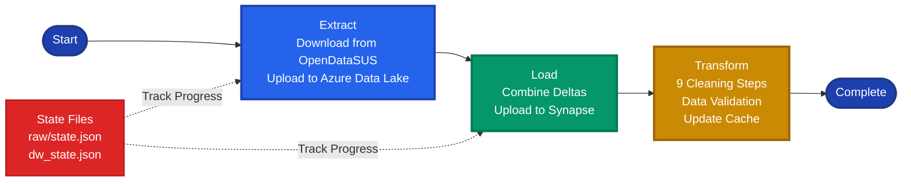
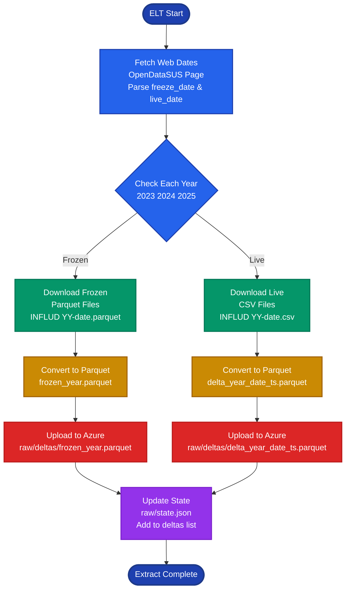
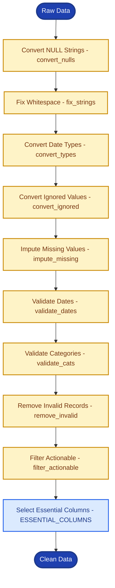
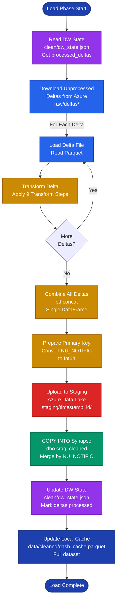
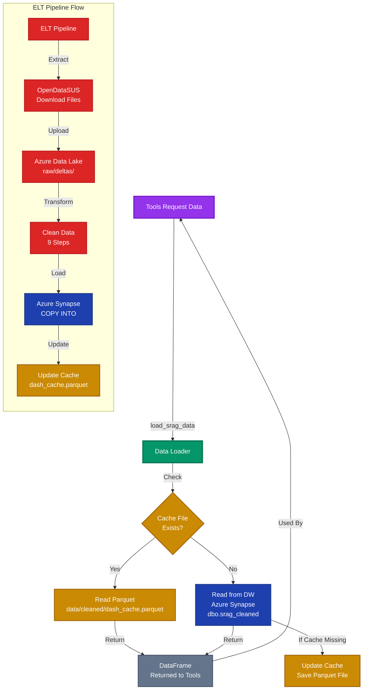

# ELT Module

> [← Back to Main README](../../README.md)

## Purpose

Incremental Extract, Load, Transform pipeline that downloads SRAG data from OpenDataSUS, cleans and validates it, and loads it into Azure Synapse Analytics. Implements delta-based incremental loading to minimize data transfer and processing time.

## Architecture

**High-level ELT pipeline showing the three main phases (Extract, Load, Transform) and state management.**

<div align="center">



</div>

**Detailed extract phase: how the system downloads frozen and live data from OpenDataSUS and uploads deltas to Azure Data Lake.**

<div align="center">



</div>

**The 9-step data transformation pipeline that cleans, validates, and prepares raw data for analysis.**

<div align="center">



</div>

**Detailed load phase: how unprocessed deltas are downloaded, transformed, combined, and loaded into Azure Synapse Analytics.**

<div align="center">



**Data access flow showing how tools request data, the cache-first strategy, and how the ELT pipeline updates both cache and data warehouse.**



</div>

**Pipeline Flow**:
```
Extract → Upload Deltas → Download Unprocessed → Load to DW → Transform → Update Cache
```

## Key Components

**`pipeline.py`** - Main orchestration:
- `run_incremental_elt()`: Executes full ELT pipeline, returns extraction date
- Coordinates extract, load, transform phases
- Manages delta uploads and DW loading
- Updates local cache (Parquet) for fast UI access

**`extract.py`** - Data extraction:
- `fetch_web_dates()`: Scrapes OpenDataSUS website for freeze/live dates
- `extract_data()`: Downloads frozen (Parquet) and live (CSV) data files
- `download_frozen()`: Downloads complete year data (won't change)
- `download_live()`: Downloads current year incremental updates
- Handles encoding fallbacks (UTF-8 → Latin-1 → Python engine)
- Tracks processed years to avoid re-downloading

**`transform.py`** - Data cleaning:
- `clean_data()`: Executes 9-step cleaning pipeline:
  1. Convert NULL strings ("NULL", "N/A", etc.) to actual nulls
  2. Fix whitespace in string columns
  3. Convert date columns with multiple format support
  4. Convert "9 = Ignored" values to NULL for specific fields
  5. Impute missing values (symptom dates, ICU flags, vaccination status)
  6. Validate date relationships (DT_SIN_PRI ≤ DT_NOTIFIC)
  7. Validate categorical values against allowed sets
  8. Remove invalid records (missing PK, all null)
  9. Filter actionable records (contribute to metrics)
- `select_essential()`: Selects only columns needed for metrics
- `impute_missing()`: Business logic imputation (ICU dates, vaccine status)
- `filter_actionable()`: Removes records that can't contribute to any metric

**`load.py`** - Backward compatibility facade:
- Re-exports public functions from azure, cache, deltas, dw, state
- Provides unified import interface

**`errors.py`** - Pipeline failure reporting:
- `ELTError(stage, message)`: raised when an ELT stage fails; used by `elt_callbacks` to show `[stage]: message` in the UI

**`azure.py`** - Azure Data Lake Gen2 operations:
- `get_client()`: Initializes FileSystemClient with DefaultAzureCredential
- `_read_json()` / `_write_json()`: State file operations
- `_upload_parquet()` / `_download_parquet()`: Parquet file transfers
- `_delete_file()` / `_delete_directory()`: Cleanup operations

**`dw.py`** - Azure Synapse Analytics operations:
- `read_from_dw()`: Reads data from SQL Data Warehouse (supports custom queries)
- `save_to_dw()`: Uses COPY INTO for fast bulk loading:
  1. Uploads DataFrame to ADLS Gen2 staging as chunked Parquet files
  2. Executes COPY INTO SQL command
  3. Cleans up staging files
  4. Adds primary key constraint if replacing table
- Supports both SQL auth and Azure AD auth

**`deltas.py`** - Delta file management:
- **Frozen deltas**: Complete year data (`frozen_2023.parquet`)
- **Live deltas**: Incremental updates (`delta_2024_15-11-2024_*.parquet`)
- `upload_frozen_delta()`: Uploads complete year, cleans up old live deltas
- `upload_live_delta()`: Uploads only new records (NU_NOTIFIC > last_max)
- `download_unprocessed_deltas()`: Combines unprocessed deltas into single DataFrame
- `mark_deltas_processed()`: Updates DW state to prevent re-processing
- `get_unprocessed_deltas()`: Compares raw_state vs dw_state to find pending deltas

**`state.py`** - State management:
- **Raw state** (`raw/state.json`): Tracks uploaded deltas, processed years, last live date
- **DW state** (`clean/dw_state.json`): Tracks processed deltas, last_max_notific, total rows
- `load_raw_state()` / `save_raw_state()`: Raw extraction state
- `load_dw_state()` / `save_dw_state()`: Data warehouse state
- `get_extraction_date()` / `update_extraction_date()`: Last extraction timestamp

**`cache.py`** - Local caching:
- `load_srag_data()`: Loads from local Parquet cache, falls back to DW if missing
- Raises `NoDataAvailableError` if no data available
- Updates cache after DW loads

**Logging**: ELT modules use `common.logging` (loguru) for info, warning, and error messages.

## Technical Details

**Incremental Strategy**:
- Frozen years: Downloaded once, never re-downloaded
- Live year: Only downloads if date changed or new records detected
- Delta tracking: Uses NU_NOTIFIC primary key to identify new records
- State files: JSON files in Azure Data Lake track processing status

**Data Quality**:
- Schema validation: Checks essential columns exist
- Date validation: Multiple format support, future date filtering
- Categorical validation: Enforces allowed values (EVOLUCAO: 1/2/3, UTI: 1/2)
- Business logic imputation: ICU dates from hospitalization dates, vaccine status from dates
- Actionable filtering: Only keeps records that can contribute to metrics

**Performance**:
- Chunked uploads: 500K rows per Parquet file for DW staging
- COPY INTO: Bulk loading via Azure Synapse COPY INTO (faster than INSERT)
- Local cache: Parquet file for fast UI access without DW queries
- Delta tracking: Avoids re-processing already-loaded data

**Error Handling**:
- `ELTError(stage, message)` for pipeline failures; extraction date is updated only on full success
- Encoding fallbacks: UTF-8 → Latin-1 → Python engine with skip bad lines
- Missing file handling: Returns None instead of raising exceptions
- State file defaults: Returns empty state dicts if files don't exist
- Connection retries: Uses Azure SDK retry logic

## Dependencies

- `pandas`: Data manipulation
- `requests`: Web scraping and file downloads
- `beautifulsoup4`: HTML parsing for date extraction
- `azure-storage-file-datalake`: Azure Data Lake Gen2 operations
- `azure-identity`: Azure authentication
- `sqlalchemy` + `pyodbc`: Azure Synapse SQL connectivity
- `pyarrow`: Parquet file operations

## Usage

Used by:
- `ui.elt_callbacks`: UI triggers ELT pipeline execution
- `tools.metric_tools`: Loads data for metric calculations
- `tools.chart_tools`: Loads data for chart generation
- `tools.reports`: Loads data for report generation
- `ui.chart_render`: Loads cached data for UI charts
