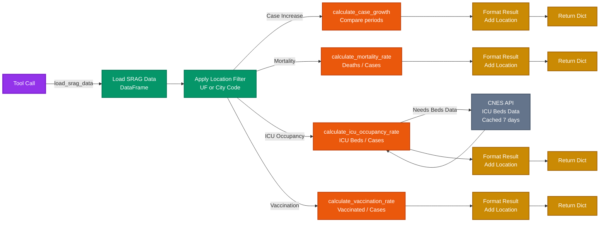

# Metrics Module

> [← Back to Main README](../../README.md)

## Purpose

Core metric calculation functions that compute epidemiological indicators from SRAG data. Provides four key metrics: case growth rate, mortality rate, ICU occupancy rate, and vaccination rates (COVID-19 and flu).

## Architecture

**Flow of metric calculations showing how each metric tool loads data, applies location filters, computes indicators, and formats results.**

## Key Components

**`calculators.py`** - Metric calculation functions:

**`calculate_case_growth()`**:
- Compares current period vs previous period case counts
- Accounts for reporting lag (excludes last N days)
- Returns percentage increase, case counts, and date ranges for both periods
- Default period: 7 days

**`calculate_mortality_rate()`**:
- Calculates percentage of cases resulting in death (EVOLUCAO = 2 or 3)
- Excludes ignored cases (EVOLUCAO = 9)
- Supports optional lookback period (months)
- Returns rate, total deaths, total cases, period dates

**`calculate_icu_occupancy_rate()`**:
- Calculates percentage of ICU beds occupied using standard formula: (Σ pacientes-dia / Σ leitos-dia) × 100
- Sources: OpenDataSUS (SRAG) for patient-days, CNES for beds (cached 7 days, fallback static data)
- Calculates patient-days: for each day in period, counts patients in ICU (DT_ENTUTI ≤ day, DT_SAIDUTI ≥ day or null)
- Fetches ICU bed counts from CNES API (via `retrieval.icu_beds`) or uses provided value
- Supports lookback period (default: 30 days). period_end limited by data vivo date (from `get_last_live_date()`), or max date in dataset, or today
- Returns occupancy_rate, patients_in_icu (snapshot at period_end), total_icu_beds, patient_days, bed_days, data_source, metadata
- Handles period limitation when data availability is shorter than requested

**`calculate_vaccination_rate()`**:
- Calculates COVID-19 and/or flu vaccination rates
- Supports "covid", "flu", or "both" vaccine types
- Excludes ignored values (9)
- Supports optional lookback period (months)
- Returns rates, vaccinated counts, total cases, period dates

## Technical Details

**Location Filtering**:
- All functions support optional `location_col` and `location_value` parameters
- Supports state-level (`SG_UF_NOT`) and city-level (`CO_MUN_NOT`) filtering
- Returns national data if no location specified

**Date Handling**:
- Auto-detects date column: prefers `DT_SIN_PRI`, falls back to `DT_NOTIFIC`
- Handles missing dates gracefully (returns None rates with error metadata)
- Period calculations account for data availability limits
- ICU period_end is limited by the data vivo date (or max date in dataset, or today)

**Data Quality**:
- Filters out null/invalid records before calculation
- Validates required columns exist before processing
- Returns structured dictionaries with error/warning metadata
- Period limitation detection for ICU and vaccination metrics

**Helper Functions**:
- `_filter_by_location()`: Location-based DataFrame filtering (UF or city code)
- `_get_date_column()`: Date column detection with fallback (prefers DT_SIN_PRI, falls back to DT_NOTIFIC)
- `_prepare_icu_patients()`: ICU patient filtering and date parsing (filters UTI=1, parses DT_ENTUTI, DT_SAIDUTI)
- `_calculate_icu_period()`: ICU period calculation with limitation detection (uses reference_date from vivo or max date)
- `_filter_icu_patients_for_period()`: Filters patients relevant for period (DT_ENTUTI ≤ period_end, handles open records)
- `_filter_current_icu_patients()`: Filters patients currently in ICU at period_end (snapshot count)
- `_calculate_patient_days()`: Calculates total patient-days for period (standard formula: Σ patients in ICU each day)
- `_resolve_icu_reference_date()`: Resolves reference date (live date, max in df, or today)
- `_fetch_cnes_beds()`: Fetches ICU bed counts from CNES API (via `retrieval.icu_beds.get_location_icu_beds()`)
- `_prepare_vaccination_data()`: Prepares vaccination data with period filtering
- `_calculate_covid_rate()` / `_calculate_flu_rate()`: Individual vaccine rate calculations
- `_max_date_from_df()`: Max date across date columns (fallback when get_last_live_date unavailable)
- `_build_icu_metadata()`: Builds metadata dictionary for ICU occupancy result

## Dependencies

- `pandas`: Data manipulation and filtering
- `retrieval.icu_beds`: ICU bed count fetching (optional, for ICU occupancy)
- `common.config`: Default lookback periods

## Usage

Used by:
- `tools.metric_tools`: Agent tool wrappers that expose metrics to the agent
