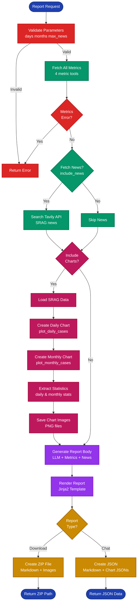

# Report Module

> [← Back to Main README](../../README.md)

## Purpose

LLM-powered report generation module that creates integrated, narrative-style SRAG situation reports. Combines metrics, charts, and news into cohesive Markdown documents with contextualized explanations.

## Architecture

**Complete report generation workflow from parameter validation through metric fetching, chart creation, LLM narrative generation, and file output (ZIP or JSON).**

## Key Components

**`generator.py`** - Main report generation:
- `generate_report_body()`: Generates integrated narrative report using LLM
- Builds context from confirmed components (metrics, charts, news)
- Only includes components that were confirmed via flags
- Returns tuple of (report_body, sources_section)
- Falls back to template-based report if LLM fails
- Context building helpers: `_build_context_header()`, `_build_metrics_context()`, `_build_charts_context()`, `_build_news_context()`
- Instruction building: `_build_instructions()` creates comprehensive LLM prompt with formatting rules

**`llm.py`** - LLM integration:
- `_get_llm()`: Lazy initialization of ChatOpenAI instance (temperature 0.3)
- `generate_executive_summary()`: Generates 2-3 paragraph executive summary from metrics and news
- `generate_metric_explanation()`: Generates contextualized explanations (2-3 sentences) for individual metrics
- `_check_data_outdated()`: Detects if data period_end is before today and adds note to prompts
- Handles LLM failures gracefully with fallback text

**`templates.py`** - Jinja2 templates:
- `validate_report_request()`: Validates report parameters (days: 7-90, months: 1-24, news: 0-5)
- `render_integrated_report()`: Renders final Markdown report using Jinja2 template
- Template includes: header with location and generation date, report body, charts section (if included), sources section, footer with data source attribution

**`formatter.py`** - Report formatting:
- `format_metrics_table()`: Creates Markdown table with metrics and LLM-generated explanations
- `format_news_section()`: Formats news articles as Markdown section (detailed or links-only)
- Truncates explanations to max length (300 chars) for table display

**`parser.py`** - Report parsing:
- `generate_report_summary()`: Extracts summary from full report for chat display
- Extracts location, report body, builds paragraphs, respects max character limit (600 chars)
- Used to show preview in chat before download

**`files.py`** - File operations:
- `save_report_to_file()`: Saves Markdown report to file
- `save_report_zip()`: Creates ZIP file with report and chart images
- Sanitizes location names for filenames
- Uses date-based naming: `Relatorio_SRAG_{location}_{date}.md` or `.zip`

**`templater.py`** - Facade module:
- Re-exports all public functions from submodules
- Provides unified import interface

## Technical Details

**Report Generation Flow**:
1. Validate request parameters (days, months, news count)
2. Collect confirmed components (metrics, charts, news)
3. Build LLM context with all confirmed data
4. Generate integrated narrative using LLM with structured prompt
5. Format sources section from news articles
6. Render final report using Jinja2 template
7. Save to file or ZIP with images

**LLM Prompt Structure**:
- Context header with location
- Metrics context (all 4 metrics with periods)
- Charts context (daily/monthly statistics)
- News context (article titles, content previews, URLs)
- Instructions: Use only confirmed data, Markdown formatting rules, integration rules, narrative flow
- Date handling: Detects outdated data and instructs LLM to mention it

**Markdown Formatting**:
- Required sections: Visão Geral, Análise das Métricas, Tendências dos Gráficos, Contexto e Notícias, Implicações e Recomendações
- Uses `##` headers for sections
- Bold for important values: `**11,5%**`
- Tables for metrics with explanations
- Sources as markdown links

**Error Handling**:
- LLM failures fall back to template-based report
- Missing components handled gracefully (only included if confirmed)
- Date parsing errors handled with fallbacks
- File I/O errors propagate (caller handles)

## Dependencies

- `langchain_openai`: LLM integration
- `jinja2`: Template rendering
- `zipfile`: ZIP file creation
- `common.config`: Validation limits, text truncation limits, model config

## Usage

Used by:
- `tools.reports`: Agent tool wrappers that generate reports from user queries
