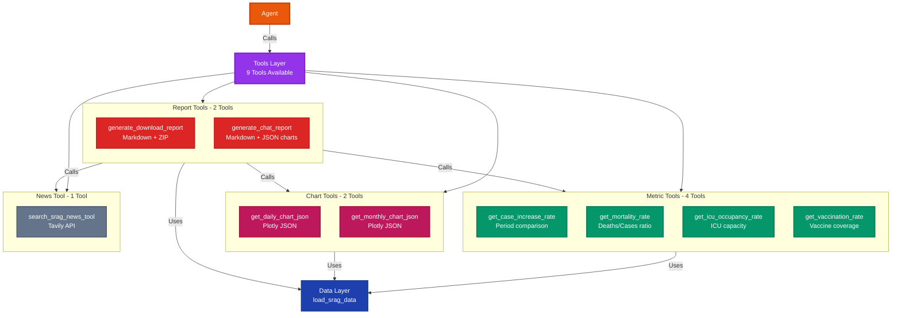
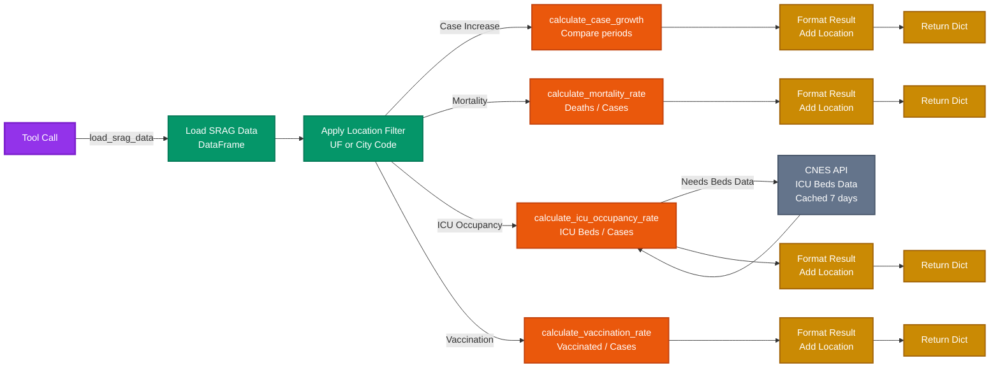
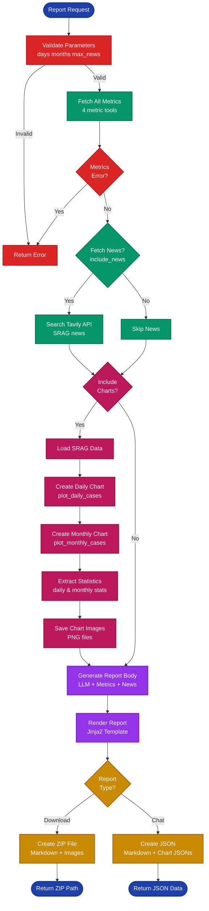

# Tools Module

> [← Back to Main README](../../README.md)

## Purpose

LangChain tool wrappers that expose SRAG data analysis capabilities to the agent. These tools are dynamically bound to the LLM and called based on user queries. Provides 9 tools: 4 metrics, 2 charts, 2 reports, and 1 news search.

## Architecture

**Complete tools catalog organized by category (Metrics, Charts, Reports, News) and their relationships with the data layer.**

**Flow of metric calculations showing how each metric tool loads data, applies location filters, and computes epidemiological indicators.**

**Complete report generation workflow from parameter validation through metric fetching, chart creation, LLM narrative generation, and file output.**

## Key Components

**`metric_tools.py`** - Metric calculation tools:
- `get_case_increase_rate()`: Case growth rate comparing current vs previous period (default: 7 days)
- `get_mortality_rate()`: Mortality percentage (deaths/cases, default: 12 months lookback)
- `get_icu_occupancy_rate()`: ICU bed occupancy rate (default: 30 days lookback). Sources: OpenDataSUS (SRAG), CNES (beds)
- `get_vaccination_rate()`: COVID-19 and/or flu vaccination rates (default: 12 months lookback)
- All tools support `uf` (state code) and `city_code` (IBGE code) parameters
- Returns structured dictionaries with rates, counts, periods, and metadata
- Handles `NoDataAvailableError` with Portuguese error messages

**`chart_tools.py`** - Chart generation tools:
- `get_daily_chart_json()`: Generates daily cases line chart as Plotly JSON
- `get_monthly_chart_json()`: Generates monthly cases bar chart as Plotly JSON
- Supports custom titles and axis labels (in user's language)
- Returns Plotly JSON strings for UI rendering
- Default periods: 30 days (daily), 12 months (monthly)

**`reports.py`** - Report generation tools:
- `generate_download_report()`: Generates complete report with LLM narrative, saves to file/ZIP
  - Fetches all 4 metrics
  - Generates chart images (PNG) for inclusion in ZIP
  - Uses LLM to generate integrated narrative
  - Saves as Markdown file or ZIP (with images)
  - Returns file path, size, and summary for chat display
- `generate_chat_report()`: Generates interactive report for chat display
  - Returns Markdown text with executive summary and metrics table
  - Includes Plotly JSON charts for inline rendering
  - No file saving (for chat display only)
- Both tools support parameter validation, component flags (include_metrics, include_news, include_charts)

**`news.py`** - News search tool:
- `search_srag_news_tool()`: Searches health news via Tavily API
- Query enhancement handled by `retrieval.news_fetcher`
- Returns list of articles with title, URL, content, date
- Max results: 5 (default), up to 20

**`location_utils.py`** - Location resolution utilities:
- `resolve_city_name()`: Converts IBGE 6-digit code to city name
  - Uses cached mapping file (`data/cleaned/city_mapping.json`)
  - Falls back to IBGE API if cache missing
  - Caches API response for future use
- `determine_location_filter()`: Returns (column, value) tuple for DataFrame filtering
  - Returns `("CO_MUN_NOT", city_code)` if city_code provided
  - Returns `("SG_UF_NOT", uf)` if uf provided
  - Returns `(None, None)` for national data
- `get_location_description()`: Returns human-readable location string
  - "Brasil (nacional)" for national
  - UF code for state
  - City name for city (resolved from code)

## Technical Details

**Tool Decorators**:
- All tools use `@tool` decorator from `langchain_core.tools`
- Parameters use `Annotated` type hints with descriptions for LLM
- Descriptions guide LLM on when to use each tool

**Error Handling**:
- All tools catch `NoDataAvailableError` and return error dictionaries
- Error messages in Portuguese from `common.config`
- Tools return structured dicts even on errors (for consistent parsing)

**Location Handling**:
- Tools accept `uf` (state) and `city_code` (IBGE) parameters
- `city_code` overrides `uf` if both provided
- Location filtering handled via `location_utils.determine_location_filter()`
- Results include `location` field with human-readable description

**Report Generation Flow**:
1. Validate parameters (days: 7-90, months: 1-24, news: 0-5)
2. Fetch all metrics for location
3. Fetch news if requested
4. Generate chart images (if charts included)
5. Generate LLM narrative with confirmed components
6. Render final report using Jinja2 template
7. Save to file/ZIP and return result dict

## Dependencies

- `langchain_core.tools`: Tool decorators and base classes
- `metrics.calculators`: Core metric calculation functions
- `charts.charts`: Chart generation functions
- `report.templater`: Report generation and formatting
- `retrieval.news_fetcher`: News search
- `elt.load`: Data loading
- `tools.location_utils`: Location resolution

## Usage

Used by:
- `agent.graph`: All 9 tools bound to LLM via `llm.bind_tools(ALL_TOOLS)`
- Tools are called automatically by agent based on user queries
