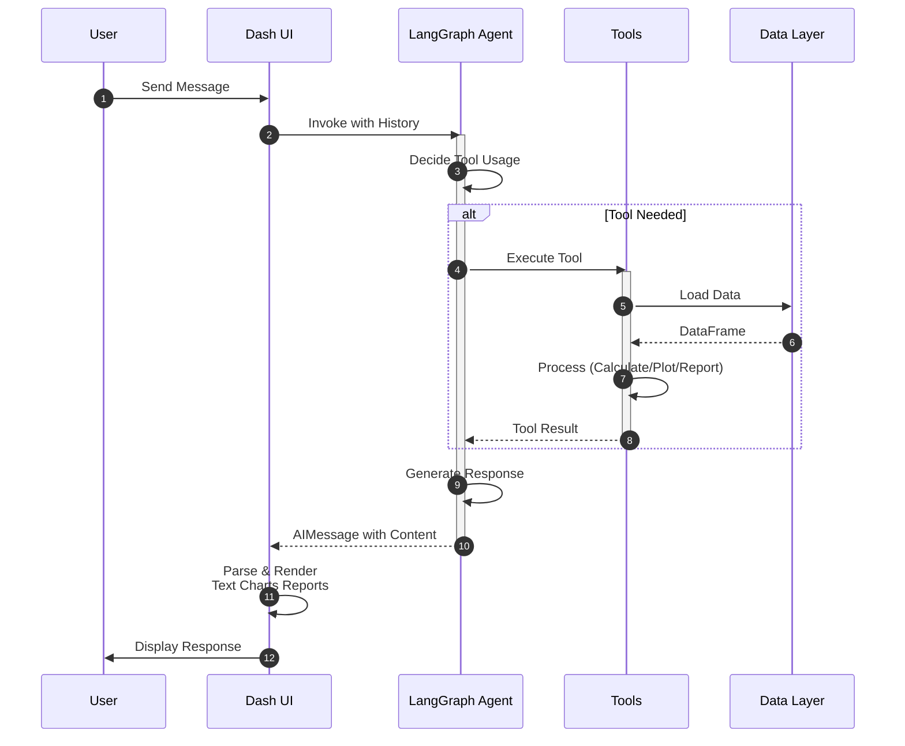

# UI Module

> [← Back to Main README](../../README.md)

## Purpose

Dash web application UI components and callbacks for the SRAG chat interface. Handles user interactions, message rendering, chart display, and ELT pipeline status updates.

## Architecture

**Complete user interaction sequence from message input through agent processing, tool execution, and response rendering in the UI.**

## Key Components

- **`layout.py`**: Main chat layout with header, message container, input field, buttons
- **`callbacks.py`**: Chat interaction callbacks (message submission, agent invocation, loading indicators)
- **`elt_callbacks.py`**: ELT pipeline UI callbacks (data update button, status polling)
- **`message.py`**: Message bubble components (user/assistant messages)
- **`response_parsing.py`**: Parses agent responses, extracts charts, tables, reports
- **`chart_render.py`**: Renders Plotly charts from JSON in chat interface
- **`chart_data.py`**: Prepares chart data and statistics
- **`tool_parsing.py`**: Parses tool outputs (reports, charts, metrics)
- **`download.py`**: Handles report file downloads
- **`loading.py`**: Loading indicator components
- **`state.py`**: UI state management (ELT status, conversation state)
- **`utils.py`**: Utility functions (date formatting, message rendering)
- **`constants.py`**: UI constants (welcome message, CSS classes)

## Technical Details

- Uses Dash Bootstrap Components for styling
- Two-phase callback pattern: immediate UI update, then async agent processing
- Auto-scrolls to latest message
- Supports HTML tables, Plotly charts, Markdown formatting
- ELT status polling every 2 seconds during pipeline execution
- `state.py`, `chart_render.py` use `common.logging` (loguru) for warnings
