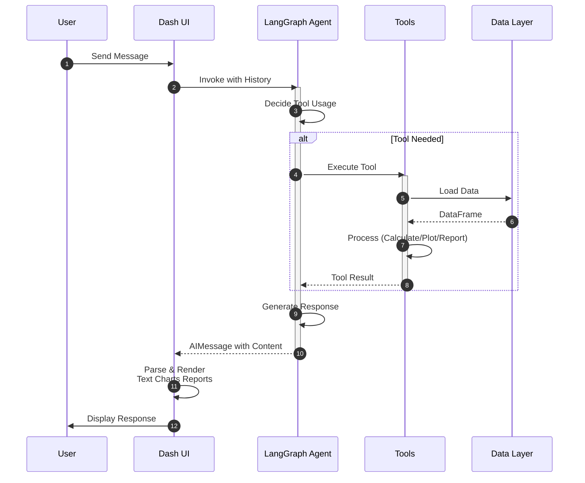

# UI Module

> [← Back to Main README](../../README.md)

## Purpose

Dash web application UI components and callbacks for the SRAG chat interface. Handles user interactions, message rendering, chart display, and ELT pipeline status updates.

## Architecture

**Complete user interaction sequence from message input through agent processing, tool execution, and response rendering in the UI.**

## Key Components

**`layout.py`** - Main UI layout:
- `create_chat_layout()`: Creates complete chat interface with header, messages area, input field
- Header includes title, subtitle, extraction date display, update/clear buttons
- Messages area with scrollable container and loading indicator overlay
- Input area with text field and send button
- All dcc.Store, Interval, and Download components

**`callbacks.py`** - Chat interaction callbacks:
- `register_chat_callbacks()`: Registers all chat-related callbacks
- Two-phase pattern: `_handle_user_message()` (immediate UI update) → `_process_agent_response()` (async agent processing)
- Loading indicator updates via shared state (`_current_loading_step`)
- Auto-scroll to latest message
- Conversation clearing
- Report download handling

**`elt_callbacks.py`** - ELT pipeline UI callbacks:
- `register_elt_callbacks()`: Registers all ELT-related callbacks
- Background callback for ELT pipeline execution
- Button state management (disabled during execution, spinner display)
- Extraction date loading and updates
- Status polling every 2 seconds during execution

**`message.py`** - Message bubble components:
- `create_message_bubble()`: Creates styled message bubbles (user/assistant)
- `render_markdown_content()`: Renders markdown with proper styling
- Supports chart figures (Plotly) and report download buttons
- Styled with CSS classes (user-message, assistant-message, has-attachments)

**`response_parsing.py`** - Agent response parsing:
- `parse_agent_response()`: Parses LangGraph agent responses
- Extracts text content, chart figures, report paths, explicit generation flag
- `_extract_tool_outputs()`: Processes ToolMessage objects to extract charts and reports
- `_build_tool_call_map()`: Maps tool_call_id to tool name and arguments
- Handles both chart tool outputs (JSON) and report tool outputs (dicts)

**`chart_render.py`** - Chart rendering:
- `render_tool_chart()`: Generates Plotly Figure from chart tool calls
- `render_daily_chart()` / `render_monthly_chart()`: Renders charts with metadata
- Used by response_parsing to convert tool outputs to displayable figures

**`chart_data.py`** - Chart data preparation:
- `prepare_dataframe()`: Filters and prepares DataFrame (re-exported from charts.stats)
- `filter_by_days()` / `filter_by_months()`: Date range filtering
- `aggregate_daily()` / `aggregate_monthly()`: Data aggregation
- `build_daily_metadata()` / `build_monthly_metadata()`: Statistics extraction

**`tool_parsing.py`** - Tool output parsing:
- `parse_tool_content()`: Parses tool message content (JSON or literal eval)
- `extract_report_info()`: Extracts report file path and content from parsed output
- Handles both `generate_download_report` and `generate_chat_report` outputs

**`download.py`** - Report download handling:
- `create_download_button()`: Creates styled download button component
- `handle_download_click()`: Handles download button clicks, finds latest report, triggers download
- Supports both Markdown and ZIP files
- Base64 encoding for ZIP files

**`loading.py`** - Loading indicators:
- `create_loading_indicator()`: Creates animated gradient text loading indicator
- Displays current step message from agent execution

**`state.py`** - UI state management:
- `get_elt_running_status()` / `set_elt_running_status()`: ELT status tracking
- Uses diskcache for server-side state
- Auto-resets if stuck too long (ELT_STATUS_TIMEOUT_SECONDS)

**`utils.py`** - Utility functions:
- `get_initial_store()`: Creates initial chat store with welcome message
- `render_messages()`: Renders list of message dictionaries as Dash components
- `extract_file_path()`: Extracts report file path from response text using regex patterns
- `format_extraction_date()` / `load_extraction_date()`: Date formatting and loading
- `format_vivo_date()`: Formats vivo date (dd-mm-yyyy) to display format
- `build_extraction_and_vivo_children()`: Builds extraction date display with optional vivo date

**`constants.py`** - UI constants:
- `WELCOME_MESSAGE`: Welcome message displayed when chat starts
- `CHART_TOOL_NAMES`: Set of chart tool names for identification
- `LOADING_DEFAULT_MESSAGE`: Default loading message
- `LOADING_VISIBLE_CLASS` / `LOADING_HIDDEN_CLASS`: CSS classes for loading visibility

## Technical Details

**Callback Architecture**:
- Two-phase pattern: `_handle_user_message()` immediately shows user message, then `_process_agent_response()` invokes agent asynchronously
- Loading indicators updated via shared mutable state (`_current_loading_step`) and interval component
- Background callbacks for ELT pipeline (non-blocking UI)
- Clientside callback for auto-scroll (JavaScript)

**Message Rendering**:
- Supports HTML tables (from agent responses), Plotly charts (from tool outputs), Markdown formatting
- Charts embedded as `dcc.Graph` components with figure dictionaries
- Report download buttons appear when `report_file_path` is present in message

**State Management**:
- Chat state stored in `dcc.Store` (messages, thread_id)
- ELT status stored in diskcache (server-side) and `dcc.Store` (client-side)
- Extraction date cached locally to avoid Azure calls during busy ELT

**Styling**:
- Uses Dash Bootstrap Components for base styling
- Custom CSS in `assets/custom.css` for chat interface
- CSS classes: `user-message`, `assistant-message`, `chat-message-bubble`, `loading-indicator-overlay`

**Error Handling**:
- `NoDataAvailableError` caught and displayed with Portuguese error messages
- Agent exceptions caught and displayed as error messages
- ELT errors displayed with stage information: `[stage]: message`

**Dependencies**:
- `dash`, `dash_bootstrap_components`: UI framework
- `plotly`: Chart rendering
- `diskcache`: Server-side state caching
- `common.logging`: Structured logging (loguru)
